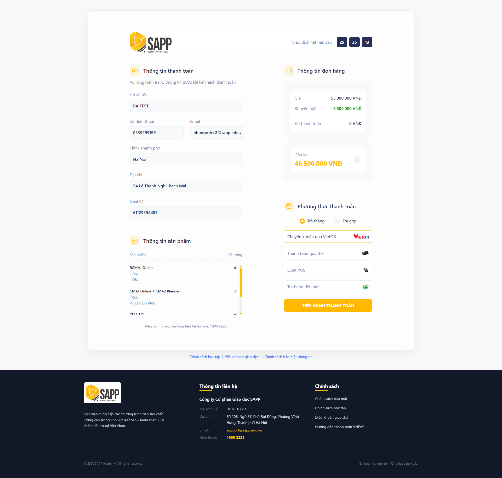
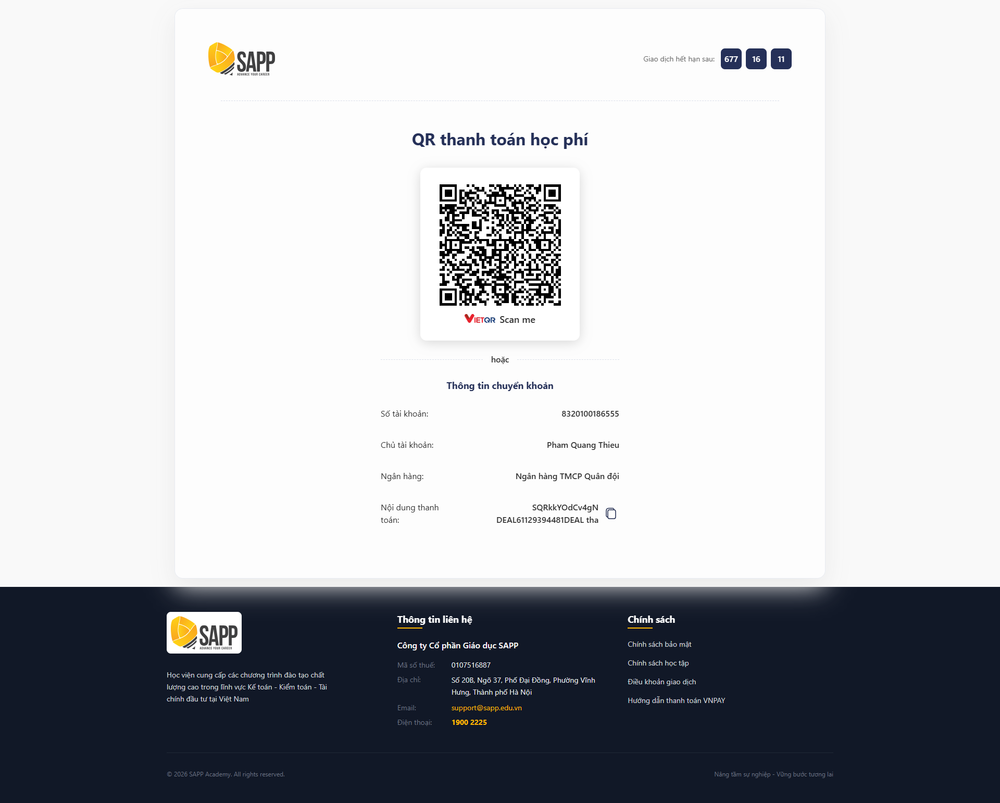

# Checkout

## Record of changes

_A - Add M - Modify D - Delete_

| Effective Date | Update Person | A,M,D | Change Description | Version |
| -------------- | ------------- | ----- | ------------------ | ------- |
| June 18, 2026  | Nhungnth      | A     | Create New         | 1.0.0   |

## I. Thông tin chung


**Dành cho:** Học viên / Khách hàng

**Kích hoạt:** Nhấn vào đường link thanh toán được gửi qua email



#### Phạm vi & Module liên quan

* **Module chính:** [Order List](./)
* **Module liên quan:** [Product](../product/), [Combo](../combo/), [Promotion Mode](../promotion-code/)
* **Hệ thống tích hợp:** HubSpot, VNPay, VietQR



#### Điều kiện tiên quyết:

1. Đơn hàng đã được khởi tạo trên hệ thống;
2. Học viên đã nhận được email chứa đường link thanh toán do SAPP gửi. Đơn hàng đã được khởi tạo trên hệ thống.


## II. Hướng dẫn chi tiết

> Checkout cho phép học viên/khách hàng kiểm tra thông tin đơn hàng và thực hiện thanh toán học phí trực tuyến.



**Truy cập đường link thanh toán qua email → Hệ thống hiển thị màn hình&#x20;**<mark style="color:$primary;">**Xác nhận thông tin**</mark>

<figure><figcaption></figcaption></figure>

Màn hình hiển thị đầy đủ thông tin đơn hàng ở chế độ read-only, bao gồm:

**1.1. Thông tin học viên**

| Trường             | Mô tả                          |
| ------------------ | ------------------------------ |
| **Full name**      | Họ tên đầy đủ của học viên     |
| **Phone**          | Số điện thoại của học viên     |
| **Email**          | Địa chỉ email của học viên     |
| **Tỉnh/Thành phố** | Khu vực sinh sống của học viên |
| **Địa chỉ**        | Địa chỉ của học viên           |
| **Deal ID**        | Mã deal trên hệ thống HubSpot  |

**1.2. Thông tin sản phẩm**

> Hiển thị danh sách sản phẩm trong đơn hàng gồm: Tên sản phẩm, Discount code, Số lượng.

**1.3. Thông tin đơn hàng**

| Trường            | Mô tả                                   |
| ----------------- | --------------------------------------- |
| **Giá**           | Tổng giá trị đơn hàng trước ưu đãi      |
| **Khuyến mãi**    | Tổng số tiền được ưu đãi                |
| **Đã thanh toán** | Số tiền đã thanh toán trước đó (nếu có) |
| **Còn lại**       | Số tiền còn phải thanh toán             |


Mục **Giá trị đã thanh toán** chỉ hiển thị khi học viên đã có lần thanh toán trước đó (Đã thanh toán > 0).




**Lựa chọn Hình thức thanh toán và Phương thức thanh toán**

<figure><figcaption></figcaption></figure>

User thực hiện lựa chọn hình thức và phương thức thanh toán tương ứng như sau:

<table><thead><tr><th width="141.33331298828125">Hình thức</th><th>Phương thức có thể chọn</th></tr></thead><tbody><tr><td><strong>Trả thẳng</strong></td><td><ul><li>Chuyển khoản</li><li>Thanh toán qua thẻ (qua VNPay)</li><li>Quẹt POS</li><li>Tiền mặt</li></ul></td></tr><tr><td><strong>Trả góp</strong></td><td><ul><li>VNPay</li><li>Quẹt POS</li></ul></td></tr></tbody></table>


#### Lưu ý lựa chọn Hình thức thanh toán

Hình thức thanh toán chỉ được chọn **một lần duy nhất** ở lần thanh toán đầu tiên và không thể thay đổi ở các lần sau.




**Nhấn "Tiến hành thanh toán" để thực hiện thanh toán**

<figure><figcaption></figcaption></figure>

Dựa trên hình thức – phương thức thanh toán user đã chọn → Hệ thống hiển thị thông tin thanh toán tương ứng.

#### 3.1. Đối với Hình thức thanh toán = Trả thẳng

Chuyển khoản

Hệ thống hiển thị **mã VietQR** để học viên chuyển khoản.

<figure><figcaption></figcaption></figure>

Khách hàng có thể thực hiện thanh toán theo 1 trong 2 cách sau:

* <mark style="color:$primary;">**Cách 1**</mark>: Quét trực tiếp mã QR hiển thị để thực hiện thanh toán
* <mark style="color:$primary;">**Cách 2**</mark>: Copy thông tin thanh toán để thực hiện thanh toán

Thanh toán qua thẻ



**Lựa chọn Loại thẻ thanh toán → chọn Tiếp theo**

User lựa chọn loại thẻ phù hợp để tiến hành thanh toán học phí, bao gồm:

* Thẻ nội địa & tài khoản ngân hàng
* Thẻ thanh toán quốc tế

<figure><figcaption></figcaption></figure>



**Nhập số tiền thanh toán lần này** **→ chọn Tiếp tục**

* Khách hàng có thể nhập số tiền muốn thanh toán cho lần hiện tại box như dưới đây:

<figure><figcaption></figcaption></figure>

* Trường hợp khách hàng muốn thanh toán toàn bộ giá trị đơn hàng, chọn checkbox **Thanh toán tổng giá trị đơn hàng**.

<figure><figcaption></figcaption></figure>

→ Hệ thống tự động xác định số tiền còn phải thanh toán.


**Lưu ý đối với số tiền thanh toán theo từng lần thanh toán**

1. <mark style="color:$primary;">Trường hợp khách hàng thanh toán lần đầu hoặc lần 2</mark>: Khách hàng có thể nhập số tiền thanh toán hoặc lựa chọn Thanh toán tổng giá trị đơn hàng.
2. <mark style="color:$primary;">Trường hợp khách hàng thanh toán lần cuối (lần 3)</mark>: Khách hàng thanh toán chính xác số tiền còn phải thanh toán.




**Nhập thông tin thẻ thanh toán**

Đối với từng loại thẻ, khách hàng nhập các thông tin theo yêu cầu. Cụ thể:

<table><thead><tr><th width="130.00006103515625">Loại thẻ</th><th>Thông tin cần nhập</th></tr></thead><tbody><tr><td>Thẻ nội địa</td><td><ol><li>Số thẻ</li><li>Tên chủ thẻ</li><li>Ngày phát hành</li><li>Mã khuyến mại (nếu có)</li></ol></td></tr><tr><td>Thẻ thanh toán quốc tế</td><td><ol><li>Số thẻ</li><li>Ngày hết hạn: được in trên mặt trước của thẻ (ví dụ: 12/25)</li><li>CVC/CVV: mã xác thực gồm 3 chữ số được in trên mặt sau của thẻ</li><li>Họ và tên khách hàng</li><li>Email</li><li>Quốc gia</li><li>Tỉnh/Thành phố</li><li>Địa chỉ</li><li>Mã khuyến mại (nếu có)</li></ol></td></tr></tbody></table>

<figure><figcaption></figcaption></figure> <figure><figcaption></figcaption></figure>

Trường hợp khách hàng muốn dừng quá trình thanh toán, vui lòng chọn **Hủy thanh toán**.



**Xác nhận điều khoản sử dụng > Chọn&#x20;**<mark style="color:$primary;">**Đồng ý & Tiếp tục**</mark>

<figure><figcaption></figcaption></figure>



**Nhập mã xác thực OTP > Chọn&#x20;**<mark style="color:$primary;">**Thanh toán**</mark>**&#x20;(nếu có)**

Khách hàng thực hiện nhập mã OTP được gửi về số điện thoại đăng ký.

Sau đó, chọn Thanh toán để hoàn tất thực hiện thanh toán.



Quẹt POS hoặc Tiền mặt

Hệ thống hiển thị thông báo hướng dẫn học viên **đến văn phòng SAPP** dưới đây để thực hiện thanh toán trực tiếp:

* <mark style="color:$primary;">Văn phòng Hà Nội</mark>: Số 54, Phố Lê Thanh Nghị, Phường Bạch Mai, Thành phố Hà Nội
* <mark style="color:$primary;">Văn phòng Hồ Chí Minh</mark>: Tầng 1, Số 2A, Đường Lương Hữu Khánh, Phường Bến Thành, Thành phố Hồ Chí Minh

<figure><figcaption></figcaption></figure>

#### 3.2. Đối với Hình thức thanh toán = Trả góp (<mark style="color:$danger;">còn VNPay)</mark>

VNPay



**Chọn ngân hàng trả góp**

<figure><figcaption></figcaption></figure>



**Chọn loại thẻ trả góp tương ứng của ngân hàng đã chọn**

<figure><figcaption></figcaption></figure>



**Chọn Số tháng trả góp**

Khách hàng lựa chọn số tháng trả góp phù hợp với 3 tháng, 6 tháng, 9 tháng hoặc 12 tháng.

<figure><figcaption></figcaption></figure>



**Xác nhận điều khoản > chọn&#x20;**<mark style="color:$primary;">**Tiếp tục**</mark>

Khách hàng xác nhận điều khoản qua checkbox _**"Tôi đồng ý với điều khoản của VNPay"**_.

<figure><figcaption></figcaption></figure>

Khách hàng chọn **Hủy thanh toán** để tạm dừng quá trình thanh toán.



**Nhập thông tin thẻ trả góp > Chọn&#x20;**<mark style="color:$primary;">**Tiếp tục**</mark>

Khách hàng thực hiện nhập các thông tin dưới đây:

* Số thẻ
* Ngày hết hạn
* CVC/CVV
* Số CMND/CCCD/HC (theo chủ thẻ)

<figure><figcaption></figcaption></figure> <figure><figcaption></figcaption></figure>




**Chọn&#x20;**<mark style="color:$primary;">**Đồng ý & Tiếp tục**</mark>**&#x20;để xác nhận điều khoản sử dụng & hoàn tất**

Sau khi xác nhận, một số thẻ yêu cầu nhập Purchase Authentication được gửi qua Số điện thoại của chủ thẻ.

⇒ Khách hàng nhập code và chọn **Submit** để hoàn tất thanh toán

<figure><figcaption></figcaption></figure> <figure><figcaption></figcaption></figure>




Quẹt POS hoặc Tiền mặt

Hệ thống hiển thị thông báo hướng dẫn học viên **đến văn phòng SAPP** dưới đây để thực hiện thanh toán trực tiếp:

* <mark style="color:$primary;">Văn phòng Hà Nội</mark>: Số 54, Phố Lê Thanh Nghị, Phường Bạch Mai, Thành phố Hà Nội
* <mark style="color:$primary;">Văn phòng Hồ Chí Minh</mark>: Tầng 1, Số 2A, Đường Lương Hữu Khánh, Phường Bến Thành, Thành phố Hồ Chí Minh

<figure><figcaption></figcaption></figure>




## III. Lưu Ý & Quy Tắc Nghiệp Vụ


### Lưu ý quan trọng

1. **Hình thức thanh toán** (Trả thẳng / Trả góp) chỉ chọn được ở lần thanh toán đầu tiên — không thể thay đổi ở lần sau
2. Tài khoản VietQR để chuyển khoản được xác định **tự động** theo danh mục sản phẩm trong đơn hàng
3. Nếu nhấn **Confirm** khi hủy thanh toán, hệ thống ghi nhận trạng thái **Thất bại** — học viên cần liên hệ SAPP để tiếp tục



### Mẹo sử dụng

1. Kiểm tra kỹ thông tin cá nhân và sản phẩm trước khi nhấn "Tiến hành thanh toán"
2. Với phương thức Chuyển khoản, quét mã QR trực tiếp trên màn hình để tránh nhập sai số tài khoản
3. Nếu thanh toán thất bại, kiểm tra email xác nhận — nếu không có email, liên hệ SAPP để xác minh giao dịch


## IV. Các Lỗi Thường Gặp & Cách Xử Lý

| Lỗi / Tình huống                                  | Nguyên nhân                                           | Cách xử lý                                                    |
| ------------------------------------------------- | ----------------------------------------------------- | ------------------------------------------------------------- |
| Link thanh toán không mở được                     | Link hết hạn hoặc đã được sử dụng                     | Liên hệ SAPP để được cấp lại link                             |
| **"Thanh toán đơn hàng thất bại"**                | Giao dịch không thành công hoặc học viên xác nhận hủy | Thử lại hoặc liên hệ SAPP để được hỗ trợ                      |
| Thông tin học viên hiển thị sai                   | Dữ liệu đồng bộ từ HubSpot chưa được cập nhật         | Liên hệ SAPP để kiểm tra và cập nhật thông tin trên Deal      |
| Không nhận được email xác nhận sau khi thanh toán | Thanh toán chưa được ghi nhận hoặc email vào spam     | Kiểm tra thư mục spam; nếu không có liên hệ SAPP              |
| Mã QR không quét được                             | Chất lượng màn hình hoặc ứng dụng ngân hàng           | Chụp ảnh màn hình rồi quét từ ảnh, hoặc nhập tay số tài khoản |
