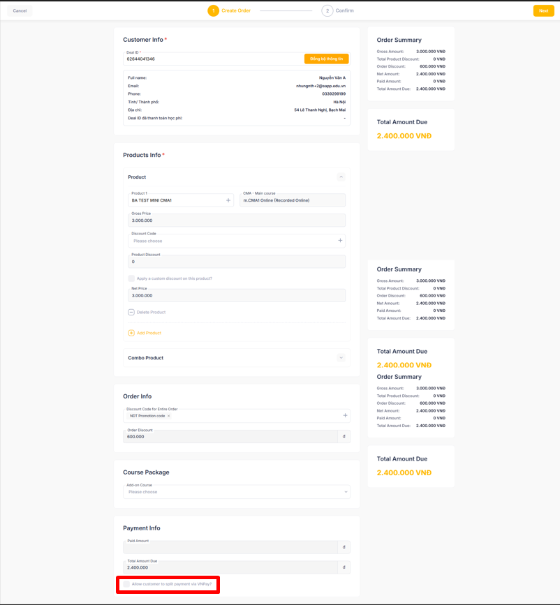
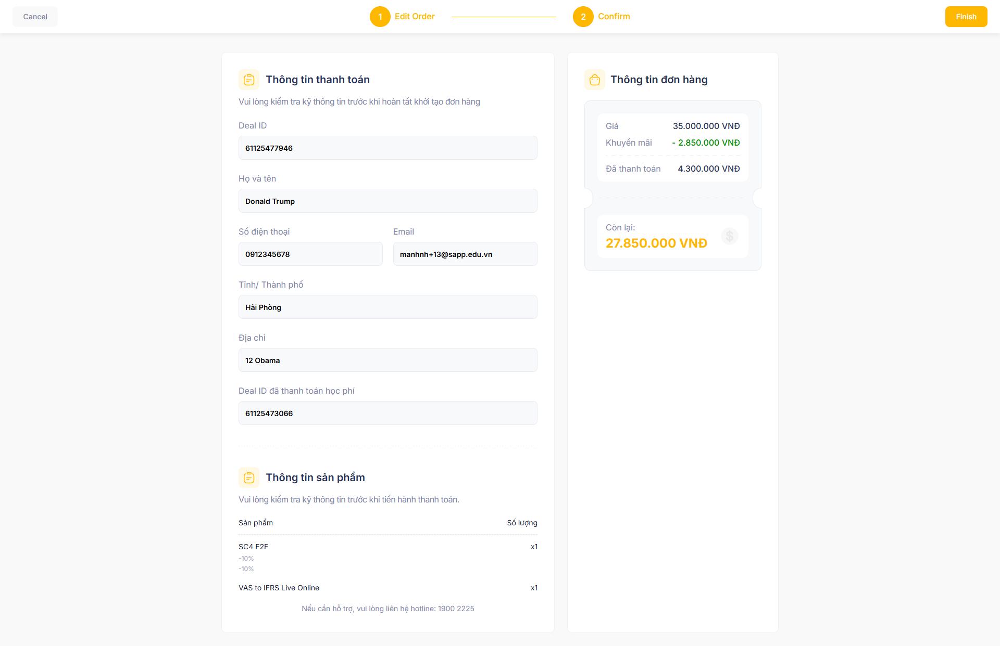

# Quản lý danh sách đơn hàng

## Record of changes

\*A - Add M - Modify D - Delete

<table><thead><tr><th width="147.99993896484375">Effective Date</th><th width="146.66668701171875">Update Person</th><th width="92.6666259765625">A,M,D</th><th width="296.0001220703125">Change Description</th><th>Version</th></tr></thead><tbody><tr><td>August 15, 2025</td><td>Nhungdh</td><td>A</td><td>Create New</td><td>3.0.0</td></tr><tr><td>June 8, 2026</td><td>Nhungnth</td><td>M</td><td>Cập nhật tính năng Order List</td><td>3.1.0</td></tr><tr><td>July 15, 2026</td><td>Nhungnth</td><td>M</td><td>Cập nhật tính năng thanh toán nhiều lần qua VNPay</td><td>3.2.0</td></tr></tbody></table>

## I. Thông tin chung


### **Đối tượng sử dụng**

* Dành cho: Admin, TVTS
* Đường dẫn: [https://ops.sapp.edu.vn/operations/sales/orders?page\_index=1\&page\_size=10](https://ops.sapp.edu.vn/operations/sales/orders?page_index=1\&page_size=10)



#### Phạm vi & Module liên quan 

* **Module chính**: Order List
* **Module liên quan**: [Product](../product/), [Combo Product](../combo/), [Promotion Codes](../promotion-code/)
* **Hệ thống tích hợp**: Hubspot



### Điều kiện tiên quyết

Đã đăng nhập và được quyền truy cập vào module Order List.


## II. Hướng dẫn chi tiết

> Order List là danh sách các đơn hàng được tạo bởi TVTS, khi khách hàng mua các sản phẩm (khóa học) được cung cấp bởi SAPP.

Xem danh sách đơn hàng



**Truy cập màn hình List of Orders**

Tại thanh menu hệ thống: chọn <mark style="color:$primary;">Order & Payment →</mark> <mark style="color:$primary;">**Order List**</mark>

<figure><figcaption></figcaption></figure>



**User có thể tìm kiếm đơn hàng theo điều kiện**

* <mark style="color:$primary;">Search Deal ID</mark>: theo deal id của deal hubspot gắn với đơn hàng
* <mark style="color:$primary;">Product</mark>: Chọn 1 giá trị trong danh sách cho trước
* <mark style="color:$primary;">Status</mark>: Chọn 1 giá trị trong danh sách cho trước.
* <mark style="color:$primary;">Sort by</mark>: Chọn cách sắp xếp sản phẩm (A-Z, Z-A, Lastest, Oldest)

Sau đó, bấm **Search** để hiển thị kết quả mong muốn.

<figure><figcaption></figcaption></figure>

Khi muốn xóa bộ lọc, user bấm **Reset** để hiển thị toàn bộ sản phẩm mặc định.



Xem chi tiết đơn hàng



**Chọn đơn hàng cần xem chi tiết**

Tại màn hình danh sách Orders, click chọn 1 trong các thông tin dưới đây để xem chi tiết thông tin đơn hàng:

* <mark style="color:$primary;">Mã đơn hàng</mark>
* <mark style="color:$primary;">Product</mark>
* <mark style="color:$primary;">Combo</mark>

<figure><figcaption></figcaption></figure> <figure><figcaption></figcaption></figure>




**Xem thông tin&#x20;**<mark style="color:$primary;">**Overview**</mark>**&#x20;của đơn hàng**

Tab Overview của đơn hàng bao gồm các sections cụ thể dưới đây.

#### 2.1. Section Order Amount

<table><thead><tr><th width="156.33331298828125">Trường thông tin</th><th>Ý nghĩa</th></tr></thead><tbody><tr><td><strong>Gross Amount</strong></td><td>
Tổng giá trị của Order (trước ưu đãi)

 Công thức tính: Gross Amount = Gross Price (Product) + Gross Price (Combo Product)
</td></tr><tr><td><strong>Total Product Discount</strong></td><td>Số tiền ưu đãi được áp dụng cho Product và Combo Product user đã chọn</td></tr><tr><td><strong>Order Discount</strong></td><td>Số tiền ưu đãi được áp dụng trên toàn bộ đơn hàng</td></tr><tr><td><strong>Net Amount</strong></td><td>
Học phí sau ưu đãi của đơn hàng 

Công thức tính: Net Amount = Gross Amount - Total Product Discount - Order Discount
</td></tr><tr><td><strong>Paid Amount</strong></td><td>Tổng số tiền khách hàng đã thanh toán</td></tr><tr><td><strong>Pay-back</strong></td><td>Tổng số học phí cần hoàn lại cho khách hàng</td></tr><tr><td><strong>Total Amount Due</strong></td><td>
Tổng số tiền khách hàng còn phải thanh toán trên đơn hàng 

Công thức tính: Total Amount Due = Net Amount - Paid Amount + Payback
</td></tr></tbody></table>

<figure><figcaption></figcaption></figure>

#### 2.2. Section Customer Info

<table><thead><tr><th width="147">Trường thông tin được đồng bộ</th><th>Ý nghĩa</th><th>Property đồng bộ</th></tr></thead><tbody><tr><td><strong>Deal ID</strong></td><td>Deal ID tương ứng với đơn hàng</td><td></td></tr><tr><td><strong>Full name</strong></td><td>Tên đầy đủ của khách hàng.</td><td>Đồng bộ từ Contact property: <mark style="color:$primary;">[TVTS] Họ tên</mark></td></tr><tr><td><strong>Email</strong></td><td>Email của khách hàng</td><td>Đồng bộ từ Contact property: <mark style="color:$primary;">Email</mark></td></tr><tr><td><strong>Phone</strong></td><td>Số điện thoại của khách hàng</td><td>Đồng bộ từ Contact property: <mark style="color:$primary;">[TVTS] Phone number</mark></td></tr><tr><td><strong>Tỉnh/Thành phố</strong></td><td>Khu vực sinh sống của khách hàng</td><td>Đồng bộ từ Contact property: <mark style="color:$primary;">[TVTS] Khu vực sinh sống</mark></td></tr><tr><td><strong>Địa chỉ</strong></td><td>Địa chỉ của khách hàng</td><td>Đồng bộ từ Contact property: <mark style="color:$primary;">[TVTS] Địa chỉ</mark></td></tr><tr><td><strong>Deal ID đã thanh toán học phí</strong></td><td>Deal của khách hàng đã bị đánh lost trước đó (do có lỗi phát sinh)</td><td>Đồng bộ từ Deal property: <mark style="color:$primary;">Deal ID đã thanh toán học phí</mark></td></tr></tbody></table>

<figure><figcaption></figcaption></figure>

#### 2.3. Section Product Info

Các thông tin được thể hiện theo _**từng sản phẩm**_ như sau:

<table><thead><tr><th width="156.33331298828125">Trường thông tin</th><th>Ý nghĩa</th></tr></thead><tbody><tr><td><strong>Product #</strong></td><td>Tên từng sản phẩm có trong đơn hàng Cho phép chọn các sản phẩm từ danh sách</td></tr><tr><td><strong>Product - Main course</strong></td><td>
Gói khóa học tương ứng với sản phẩm khách hàng mua.

Tự động cập nhật theo Product đã chọn. Trong đó, <em><mark style="color:$primary;">Product</mark></em> được xác định dựa trên Category của sản phẩm
</td></tr><tr><td><strong>Gross Price</strong></td><td>Giá gốc của sản phẩm lựa chọn Hệ thống cập nhật tự động</td></tr><tr><td><strong>Product Discount</strong></td><td>Tổng số tiền được discount đối với sản phẩm lựa chọn</td></tr><tr><td><strong>Custom Product Discount</strong></td><td>Số tiền học viên được discount bổ sung đối với sản phẩm được chọn</td></tr><tr><td><strong>Net Price</strong></td><td>
Giá sau ưu đãi của sản phẩm 

Công thức tính: Net Price = Gross Price - (Product Discount + Custom Product Discount)
</td></tr></tbody></table>

<figure><figcaption></figcaption></figure>

Các thông tin được thể hiện theo từng _**nhóm sản phẩm**_ như sau:

<table><thead><tr><th width="156.33331298828125">Trường thông tin</th><th>Ý nghĩa</th></tr></thead><tbody><tr><td><strong>Combo #</strong></td><td>Tên từng nhóm sản phẩm có trong đơn hàng Cho phép chọn nhiều nhóm sản phẩm từ danh sách</td></tr><tr><td><strong>Product - Main course</strong></td><td>
Gói khóa học tương ứng với các sản phẩm có trong combo khách hàng mua.

Tự động cập nhật theo Product thuộc Combo đã chọn - được xác định dựa trên Category của sản phẩm
</td></tr><tr><td><strong>Gross Price</strong></td><td>Giá gốc của nhóm sản phẩm lựa chọn. Hệ thống cập nhật tự động</td></tr><tr><td><strong>Combo Discount</strong></td><td>
Tổng số tiền được discount đối với nhóm sản phẩm lựa chọn

Hệ thống cập nhật tự động.
</td></tr><tr><td><strong>Custom Combo Discount</strong></td><td>Số tiền học viên được discount bổ sung đối với nhóm sản phẩm được chọn  Tự động cập nhật theo <mark style="color:$primary;">Discount rate</mark> và <mark style="color:$primary;">Custom Discount</mark></td></tr><tr><td><strong>Net Price</strong></td><td>
Giá sau ưu đãi của nhóm sản phẩm 

Công thức tính: Net Price = Gross Price - (Product Discount + Custom Product Discount)
</td></tr></tbody></table>

<figure><figcaption></figcaption></figure>

#### 2.4. Section Course Package

| Trường thông tin   | Ý nghĩa                              |
| ------------------ | ------------------------------------ |
| **Add-On Courses** | Gói khóa học tặng kèm cho khách hàng |

<figure><figcaption></figcaption></figure>

#### 2.5. Section Order Info

| Trường thông tin                   | Ý nghĩa                                                       |
| ---------------------------------- | ------------------------------------------------------------- |
| **Discount Code for Entire Order** | Danh sách các mã khuyến mãi được áp dụng cho toàn bộ đơn hàng |
| **Order Discount**                 | Giá trị ưu đãi được áp dụng cho toàn bộ đơn hàng              |

<figure><figcaption></figcaption></figure>

#### 2.4. Section Payment Info

| Trường thông tin     | Ý nghĩa                                                                                                                                          |
| -------------------- | ------------------------------------------------------------------------------------------------------------------------------------------------ |
| **Paid Amount**      | Tổng số tiền khách hàng đã thanh toán                                                                                                            |
| **Total Amount Due** | 
Tổng số tiền khách hàng còn phải thanh toán trên đơn hàng 

Công thức tính: Total Amount Due = Net Amount - Paid Amount + Payback
 |

<figure><figcaption></figcaption></figure>



**Xem thông tin đồng bộ giữa Hubspot và Ops**

Tab Hubspot của đơn hàng bao gồm các sections cụ thể dưới đây.

#### 3.1. Data Synchronized from HubSpot

<table><thead><tr><th width="146">Trường thông tin được đồng bộ</th><th>Ý nghĩa</th><th>Property đồng bộ từ Hubspot</th></tr></thead><tbody><tr><td><strong>Deal ID</strong></td><td>Deal ID tương ứng với đơn hàng</td><td></td></tr><tr><td><strong>Full name</strong></td><td>Tên đầy đủ của khách hàng.</td><td>Đồng bộ từ Contact property: <mark style="color:$primary;">[TVTS] Họ tên</mark></td></tr><tr><td><strong>Email</strong></td><td>Email của khách hàng</td><td>Đồng bộ từ Contact property: <mark style="color:$primary;">Email</mark></td></tr><tr><td><strong>Phone</strong></td><td>Số điện thoại của khách hàng</td><td>Đồng bộ từ Contact property: <mark style="color:$primary;">[TVTS] Phone number</mark></td></tr><tr><td><strong>Tỉnh/Thành phố</strong></td><td>Khu vực sinh sống của khách hàng</td><td>Đồng bộ từ Contact property: <mark style="color:$primary;">[TVTS] Khu vực sinh sống</mark></td></tr><tr><td><strong>Địa chỉ</strong></td><td>Địa chỉ của khách hàng</td><td>Đồng bộ từ Contact property: <mark style="color:$primary;">[TVTS] Địa chỉ</mark></td></tr><tr><td><strong>Deal ID đã thanh toán học phí</strong></td><td>Deal của khách hàng đã bị đánh lost trước đó (do có lỗi phát sinh)</td><td>Đồng bộ từ Deal property: <mark style="color:$primary;">Deal ID đã thanh toán học phí</mark></td></tr></tbody></table>

<figure><figcaption></figcaption></figure>

#### 3.2. Data Synchronized to HubSpot

<table><thead><tr><th width="146">Trường thông tin được đồng bộ</th><th width="211">Ý nghĩa</th><th>Property đồng bộ từ Hubspot</th></tr></thead><tbody><tr><td><strong>Product - Main couse</strong></td><td>Deal ID tương ứng với đơn hàng</td><td>Tương ứng với Category, được đồng bộ về các Deal properties: 1. <a href="https://app.hubspot.com/property-settings/1774127/properties?type=0-3&#x26;search=G%C3%B3i%20kh%C3%B3a%20h%E1%BB%8Dc%20ch%C3%ADnh&#x26;action=edit&#x26;property=acca___lo_trinh_dang_ky">ACCA - Gói khóa học chính</a> 2. <a href="https://app.hubspot.com/property-settings/1774127/properties?type=0-3&#x26;search=G%C3%B3i%20kh%C3%B3a%20h%E1%BB%8Dc%20ch%C3%ADnh&#x26;action=edit&#x26;property=cfa___lo_trinh_dang_ky">CFA - Gói khóa học chính</a> 3. <a href="https://app.hubspot.com/property-settings/1774127/properties?type=0-3&#x26;search=G%C3%B3i%20kh%C3%B3a%20h%E1%BB%8Dc%20ch%C3%ADnh&#x26;action=edit&#x26;property=cma___lo_trinh_dang_ky">CMA - Gói khóa học chính</a> 4. <a href="https://app.hubspot.com/property-settings/1774127/properties?type=0-3&#x26;search=G%C3%B3i%20kh%C3%B3a%20h%E1%BB%8Dc%20ch%C3%ADnh&#x26;action=edit&#x26;property=ifrs___lo_trinh_dang_ky">IFRS - Gói khóa học chính</a> 5. <a href="https://app.hubspot.com/property-settings/1774127/properties?type=0-3&#x26;search=G%C3%B3i%20kh%C3%B3a%20h%E1%BB%8Dc%20ch%C3%ADnh&#x26;action=edit&#x26;property=shortcourse___lo_trinh_dang_ky">Shortcourse - Gói khóa học chính</a> 6. <a href="https://app.hubspot.com/property-settings/1774127/properties?type=0-3&#x26;search=CGMA%20-&#x26;action=edit&#x26;property=cgma___goi_khoa_hoc_chinh">CGMA - Gói khóa học chính</a></td></tr><tr><td><strong>Add-on Couse</strong></td><td>Tên đầy đủ của khách hàng.</td><td>Đồng bộ về Deal property: <a href="https://app.hubspot.com/property-settings/1774127/properties?type=0-3&#x26;search=t%E1%BA%B7ng%20k%C3%A8m&#x26;action=edit&#x26;property=goi_khoa_hoc_tang_kem">[TVTS] Gói khóa học tặng kèm</a></td></tr><tr><td><strong>Gross Amount</strong></td><td>
Tổng giá trị của Order (trước ưu đãi)

 Công thức tính: Gross Amount = Gross Price (Product) + Gross Price (Combo Product)
</td><td>Đồng bộ về Deal property: <a href="https://app.hubspot.com/property-settings/1774127/properties?type=0-3&#x26;search=h%E1%BB%8Dc%20ph%C3%AD%20g%E1%BB%91c&#x26;action=edit&#x26;property=hoc_phi_goc"><mark style="color:$primary;">[TVTS] Học phí gốc</mark></a></td></tr><tr><td><strong>Total Order Discount</strong></td><td>Số điện thoại của khách hàng</td><td>Đồng bộ về Deal property: <a href="https://app.hubspot.com/property-settings/1774127/properties?type=0-3&#x26;search=%C6%B0u%20%C4%91%C3%A3i&#x26;action=edit&#x26;property=hoc_phi_uu_dai">[TVTS] Học phí ưu đãi áp dụng</a></td></tr><tr><td><strong>Net Amount</strong></td><td>Khu vực sinh sống của khách hàng</td><td>Đồng bộ về Deal property: <a href="https://app.hubspot.com/property-settings/1774127/properties?type=0-3&#x26;search=amount&#x26;action=edit&#x26;property=amount">Amount</a></td></tr><tr><td><strong>Paid Amount</strong></td><td>Địa chỉ của khách hàng</td><td>Hệ thống tính tự động</td></tr><tr><td><strong>Total Amount Due</strong></td><td>Deal của khách hàng đã bị đánh lost trước đó (do có lỗi phát sinh)</td><td>Hệ thống tính tự động</td></tr><tr><td><strong>Order ID</strong></td><td>Mã đơn hàng trên Ops</td><td>Đồng bộ về Deal property: <a href="https://app.hubspot.com/property-settings/1774127/properties?type=0-3&#x26;search=order%20id&#x26;action=edit&#x26;property=order_id">Order ID</a></td></tr></tbody></table>


#### Lưu ý về đồng bộ thông tin lên HubSpot

User có thể chọn **Resync** để đồng bộ lại thông tin đơn hàng trong trường hợp Synchronized Status = Thất bại


<figure><figcaption></figcaption></figure>

#### 3.3. Data Synchronized — Thông tin giao dịch

Tương ứng mỗi Transaction với Transaction Type = Thu học phí, thông tin giao dịch đều được đồng bộ lên HubSpot theo nguyên tắc như sau:

<table><thead><tr><th width="270">Trường thông tin</th><th>Ý nghĩa</th></tr></thead><tbody><tr><td><strong>Amount paid by students</strong></td><td>Số tiền học viên thanh toán từng lần</td></tr><tr><td><strong>Payment Method</strong></td><td>Phương thức thanh toán từng lần</td></tr><tr><td><strong>Paid date</strong></td><td>Ngày thanh toán từng lần</td></tr></tbody></table>

Trong đó, chi tiết Payment Method được ghi nhận như sau:



<table><thead><tr><th width="184">Phương thức thanh toán lần #</th><th>Trường hợp ghi nhận</th></tr></thead><tbody><tr><td>MB SAPP</td><td>Khách hàng mua các sản phẩm có Category = B2B hoặc CGMA</td></tr><tr><td>MB SAA</td><td>Khách hàng mua các sản phẩm có Category = ACCA hoặc Cert/Dip</td></tr><tr><td>MB SCFA</td><td>Khách hàng mua các sản phẩm có Category = CFA</td></tr><tr><td>MB SCMA</td><td>Khách hàng mua các sản phẩm có Category = CMA hoặc Short courses</td></tr></tbody></table>



<table><thead><tr><th width="185">Phương thức thanh toán lần #</th><th>Trường hợp ghi nhận</th></tr></thead><tbody><tr><td>VNPay TT</td><td>Khách hàng thanh toán với Hình thức thanh toán = Trả thẳng, phương thức thanh toán = Thanh toán qua thẻ</td></tr><tr><td>VNPay TG</td><td>Khách hàng thanh toán với Hình thức thanh toán = Trả góp, phương thức thanh toán = VNPay</td></tr></tbody></table>



<table><thead><tr><th width="185">Phương thức thanh toán lần #</th><th>Trường hợp ghi nhận</th></tr></thead><tbody><tr><td>POS TT</td><td>Khách hàng thanh toán với Hình thức thanh toán = Trả thẳng, phương thức thanh toán = Thanh toán qua thẻ</td></tr><tr><td>POS TG</td><td>Khách hàng thanh toán với Hình thức thanh toán = Trả góp, phương thức thanh toán = VNPay</td></tr></tbody></table>



<table><thead><tr><th width="185">Phương thức thanh toán lần #</th><th>Trường hợp ghi nhận</th></tr></thead><tbody><tr><td>TM NEU</td><td>Khách hàng thanh toán học phí trực tiếp tại cơ sở NEU</td></tr><tr><td>TM UEH</td><td>Khách hàng thanh toán học phí trực tiếp tại cơ sở UEH</td></tr></tbody></table>



<figure><figcaption></figcaption></figure>



**Xem&#x20;**<mark style="color:$primary;">**Transaction List**</mark>**&#x20;của đơn hàng**

Tham chiếu nội dung chi tiết tại [Quản lý danh sách giao dịch](quan-ly-danh-sach-giao-dich.md)



Tạo mới đơn hàng



**Tại màn hình List of Orders, chọn&#x20;**<mark style="color:$primary;">**New Order**</mark>

<figure><figcaption></figcaption></figure>



**Tại section Customer Info: Cập nhật&#x20;**<mark style="color:$primary;">**Deal ID**</mark>**&#x20;> Chọn&#x20;**<mark style="color:$primary;">**Đồng bộ thông tin**</mark>

* User nhập Deal ID của deal tương ứng trên HubSpot.
* Hệ thống tự động đồng bộ thông tin khách hàng từ HubSpot như dưới đây:

<table><thead><tr><th width="147">Trường thông tin được đồng bộ</th><th>Ý nghĩa</th><th>Property đồng bộ</th></tr></thead><tbody><tr><td>Full name</td><td>Tên đầy đủ của khách hàng.</td><td>Đồng bộ từ Contact property: <mark style="color:$primary;">[TVTS] Họ tên</mark></td></tr><tr><td>Email</td><td>Email của khách hàng</td><td>Đồng bộ từ Contact property: <mark style="color:$primary;">Email</mark></td></tr><tr><td>Phone</td><td>Số điện thoại của khách hàng</td><td>Đồng bộ từ Contact property: <mark style="color:$primary;">[TVTS] Phone number</mark></td></tr><tr><td>Tỉnh/Thành phố</td><td>Khu vực sinh sống của khách hàng</td><td>Đồng bộ từ Contact property: <mark style="color:$primary;">[TVTS] Khu vực sinh sống</mark></td></tr><tr><td>Địa chỉ</td><td>Địa chỉ của khách hàng</td><td>Đồng bộ từ Contact property: <mark style="color:$primary;">[TVTS] Địa chỉ</mark></td></tr><tr><td>Deal ID đã thanh toán học phí</td><td>Deal của khách hàng đã bị đánh lost trước đó (do có lỗi phát sinh)</td><td>Đồng bộ từ Deal property: <mark style="color:$primary;">Deal ID đã thanh toán học phí</mark></td></tr></tbody></table>

<figure><figcaption></figcaption></figure> <figure><figcaption></figcaption></figure>




**Tại section&#x20;**<mark style="color:$primary;">**Product Info**</mark>**: Thêm&#x20;**<mark style="color:$primary;">**Product**</mark>**&#x20;(nếu có)**

* Chọn <mark style="color:$primary;">Add Product</mark> > Chọn **Select** để thêm các sản phẩm từ màn hình danh sách.

<figure><figcaption></figcaption></figure> <figure><figcaption></figcaption></figure>

> User tìm kiếm nhanh sản phẩm theo các điều kiện dưới đây:
>
> * Product name
> * Category
> * Sort by (A-Z, Z-A, Latest, Oldest)

* Chọn <mark style="color:$primary;">Discount code</mark> tương ứng của sản phẩm, cho phép _**chọn nhiều mã cùng lúc**_.

<figure><figcaption></figcaption></figure> <figure><figcaption></figcaption></figure>

> **Lưu ý**: Trường hợp không tìm được discount code phù hợp, cho phép user **tạo Promotion code** ngay tại giao diện Select Promotions. Chi tiết hướng dẫn tạo Promotion code [tại đây](../promotion-code/#tao-moi-ma-khuyen-mai).

<figure><figcaption></figcaption></figure> <figure><figcaption></figcaption></figure>

* Tick checkbox "_<mark style="color:$primary;">**Apply a custom discount on this product?**</mark>_" trong trường hợp sản phẩm được áp dụng bổ sung các mã khuyến mãi.

→ Chọn <mark style="color:$primary;">**Type of Custom Product Discount**</mark>

<figure><figcaption></figcaption></figure>

Chi tiết các trường thông tin của Product trên đơn hàng được thể hiện dưới đây:

<table><thead><tr><th width="156.33331298828125">Trường thông tin</th><th>Ý nghĩa</th></tr></thead><tbody><tr><td>Product #</td><td>Tên từng sản phẩm có trong đơn hàng Cho phép chọn các sản phẩm từ danh sách</td></tr><tr><td>Product - Main course</td><td>
Gói khóa học tương ứng với sản phẩm khách hàng mua.

Tự động cập nhật theo Product đã chọn. Trong đó, <em><mark style="color:$primary;">Product</mark></em> được xác định dựa trên Category của sản phẩm
</td></tr><tr><td>Gross Price</td><td>Giá gốc của sản phẩm lựa chọn Hệ thống cập nhật tự động</td></tr><tr><td>Discount code</td><td>Mã khuyến mãi áp dụng trên sản phẩm Cho phép <em><strong>chọn nhiều mã</strong></em> khuyến mại cùng lúc</td></tr><tr><td>Product Discount</td><td>
Tổng số tiền được discount đối với sản phẩm lựa chọn

Hệ thống cập nhật tự động.
</td></tr><tr><td>Apply of Custom Product Discount?</td><td>Xác nhận áp dụng khuyến mại bổ sung</td></tr><tr><td>Type of Custom Product Discount</td><td>Lựa chọn loại khuyến mại bổ sung được áp dụng, bao gồm: - <strong>Fixed Amount</strong>: giảm trừ bổ sung theo số tiền nhất định - <strong>Percent</strong>: giảm trừ bổ sung theo tỷ lệ %</td></tr><tr><td>Discount Rate</td><td>Tỷ lệ % khuyến mại được áp dụng bổ sung Chỉ cập nhật trong trường hợp Type of Custom Product Discount = Percent</td></tr><tr><td>Custom Discount</td><td>Số tiền học viên được discount bổ sung Chỉ cập nhật trong trường hợp Type of Custom Product Discount = Fixed Amount</td></tr><tr><td>Custom Product Discount</td><td>Số tiền học viên được discount bổ sung đối với sản phẩm được chọn  Hệ thống cập nhật tự động dựa trên Discount Rate và Custom Discount</td></tr><tr><td>Net Price</td><td>
Giá sau ưu đãi của sản phẩm 

Công thức tính: Net Price = Gross Price - (Product Discount + Custom Product Discount)
</td></tr></tbody></table>


Lưu ý: Trường hợp user muốn **Xóa** hoặc **Thêm** sản phẩm > Chọn <mark style="color:$primary;">Delete Product</mark> hoặc <mark style="color:$primary;">Add Product</mark> tại section Product.


<figure><figcaption></figcaption></figure>



**Tại section&#x20;**<mark style="color:$primary;">**Product Info**</mark>**: Thêm&#x20;**<mark style="color:$primary;">**Combo**</mark>**&#x20;(nếu có)**

* Chọn <mark style="color:$primary;">Add Combo</mark> > Chọn **Select** để thêm các nhóm sản phẩm từ màn hình danh sách

<figure><figcaption></figcaption></figure> <figure><figcaption></figcaption></figure>

> User tìm kiếm nhanh nhóm sản phẩm theo các điều kiện dưới đây:
>
> * Combo name
> * Product
> * Category
> * Sort by (A-Z, Z-A, Latest, Oldest)

* Chọn <mark style="color:$primary;">Discount code</mark> áp dụng cho nhóm sản phẩm, cho phép _**chọn nhiều mã cùng lúc**_.

<figure><figcaption></figcaption></figure> <figure><figcaption></figcaption></figure>

> **Lưu ý**: Trường hợp không tìm được discount code phù hợp, cho phép user **tạo Promotion code** ngay tại giao diện Select Promotions. Chi tiết hướng dẫn tạo Promotion code [tại đây](../promotion-code/#tao-moi-ma-khuyen-mai).

* Tick checkbox "_<mark style="color:$primary;">**Apply a custom discount on this combo?**</mark>_" trong trường hợp nhóm sản phẩm được áp dụng bổ sung các mã khuyến mãi.

→ Chọn <mark style="color:$primary;">**Type of Custom Combo Discount**</mark>

<figure><figcaption></figcaption></figure>

Chi tiết các trường thông tin của Combo trên đơn hàng được thể hiện dưới đây:

<table><thead><tr><th width="156.33331298828125">Trường thông tin</th><th>Ý nghĩa</th></tr></thead><tbody><tr><td>Combo #</td><td>Tên từng nhóm sản phẩm có trong đơn hàng Cho phép chọn nhiều nhóm sản phẩm từ danh sách</td></tr><tr><td>Product - Main course</td><td>
Gói khóa học tương ứng với các sản phẩm có trong combo khách hàng mua.

Tự động cập nhật theo Product thuộc Combo đã chọn - được xác định dựa trên Category của sản phẩm
</td></tr><tr><td>Gross Price</td><td>Giá gốc của nhóm sản phẩm lựa chọn. Hệ thống cập nhật tự động</td></tr><tr><td>Discount code</td><td>Mã khuyến mãi áp dụng trên nhóm sản phẩm Cho phép <em><strong>chọn nhiều mã</strong></em> khuyến mại cùng lúc</td></tr><tr><td>Combo Discount</td><td>
Tổng số tiền được discount đối với nhóm sản phẩm lựa chọn

Hệ thống cập nhật tự động.
</td></tr><tr><td>Apply of Custom Combo Discount?</td><td>Xác nhận áp dụng khuyến mại bổ sung đối với combo</td></tr><tr><td>Type of Custom Combo Discount</td><td>Lựa chọn loại khuyến mại bổ sung được áp dụng, bao gồm: - <strong>Fixed Amount</strong>: giảm trừ bổ sung theo số tiền nhất định - <strong>Percent</strong>: giảm trừ bổ sung theo tỷ lệ %</td></tr><tr><td>Discount Rate</td><td>Tỷ lệ % khuyến mại được áp dụng bổ sung Chỉ cập nhật trong trường hợp Type of Custom Product Discount = <strong>Percent</strong></td></tr><tr><td>Custom Discount</td><td>Số tiền học viên được discount bổ sung  Chỉ cập nhật trong trường hợp Nếu Type of Custom Product Discount = <strong>Fixed Amount</strong></td></tr><tr><td>Custom Combo Discount</td><td>Số tiền học viên được discount bổ sung đối với nhóm sản phẩm được chọn  Tự động cập nhật theo <mark style="color:$primary;">Discount rate</mark> và <mark style="color:$primary;">Custom Discount</mark></td></tr><tr><td>Net Price</td><td>
Giá sau ưu đãi của nhóm sản phẩm 

Công thức tính: Net Price = Gross Price - (Product Discount + Custom Product Discount)
</td></tr></tbody></table>


Lưu ý: Trường hợp user muốn **Xóa** hoặc **Thêm** nhóm sản phẩm > Chọn <mark style="color:$primary;">Delete Combo Product</mark> hoặc <mark style="color:$primary;">Add Combo Product</mark> tại section Combo.


<figure><figcaption></figcaption></figure>



**Chọn&#x20;**<mark style="color:$primary;">**Discount Code for Entire Order**</mark>**&#x20;(nếu có)**

User chọn Discount Code từ màn hình danh sách Promotion Code.

<figure><figcaption></figcaption></figure>

Cho phép tìm kiếm nhanh theo các điều kiện dưới đây:

* Name: Tên của mã khuyến mại
* Category:
* Sort by (A-Z, Z-A, Latest, Oldest)
* From date - To date: Thời gian hiệu lực của promotion code

<table><thead><tr><th width="150.66668701171875">Trường thông tin</th><th>Ý nghĩa</th></tr></thead><tbody><tr><td>Discount code for Entire Order</td><td>Các mã khuyến mại được áp dụng cho toàn bộ đơn hàng</td></tr><tr><td>Order Discount</td><td>Số tiền học viên được giảm giá trên toàn bộ đơn hàng  Hệ thống tự động cập nhật theo Order Discount Code đã chọn</td></tr></tbody></table>



**Tại section&#x20;**<mark style="color:$primary;">**Course Package**</mark>**: Chọn&#x20;**<mark style="color:$primary;">**Add-on Course**</mark>

User chọn các khóa học học viên được tặng kèm trên Order

<figure><figcaption></figcaption></figure>



**Tại section Payment Info: User quyết định khách hàng có thể thanh toán nhiều lần qua VNPay hay không?**

Trong đó, nếu:

* Nếu khách hàng có thể thanh toán thành nhiều lần khi trả thẳng qua VNPay: User tick vào checkbox **Allow customer to split payment via VNPay**
* Nếu khách hàng không được thanh toán thành nhiều lần khi trả thẳng qua VNPay: User <mark style="color:$danger;">KHÔNG TICK</mark> vào checkbox trên

<figure><figcaption></figcaption></figure>

Lưu ý về một số bối cảnh để đảm bảo khách hàng được thanh toán nhiều lần qua VNPay. Cụ thể như sau:

<table><thead><tr><th width="190">Tình huống</th><th width="174">Cách thức xử lý của TVTS</th><th>Cách thức hệ thống xử lý</th></tr></thead><tbody><tr><td>Khách hàng muốn chuyển khoản/tiền mặt/quẹt POS một phần, còn lại là Trả góp.</td><td>Không tick checkbox <strong>Allow customer to split payment via VNPay?</strong></td><td>Hoạt động vận hành không thay đổi so với hiện tại</td></tr><tr><td>Khách hàng muốn thanh toán 2 lần qua chuyển khoản/tiền mặt/quẹt POS và VNPay <em><strong>(không xác định thứ tự trước - sau)</strong></em></td><td>Tick checkbox <strong>Allow customer to split payment via VNPay?</strong></td><td>Trong trường hợp khách hàng lựa chọn thanh toán qua VNPay trước, hệ thống sẽ hiển thị màn hình cho phép: 1. Lựa chọn Ngân hàng thanh toán 2. Nhập số tiền muốn thanh toán từng lần</td></tr><tr><td>Khách hàng muốn Trả thẳng qua thẻ một phần, còn lại là Trả góp.</td><td>Tick checkbox <strong>Allow customer to split payment via VNPay?</strong></td><td><ol><li><strong>Khách hàng thanh toán 1 &#x26; 2 qua VNPay TT</strong>: Hệ thống sẽ hiển thị màn hình cho phép: - Lựa chọn Ngân hàng thanh toán - Nhập số tiền muốn thanh toán từng lần hoặc chọn Thanh toán toàn bộ giá trị đơn hàng</li><li><strong>Khách hàng thanh toán lần 3 qua VNPay TG</strong>: Khách hàng thanh toán toàn bộ số tiền còn lại</li></ol></td></tr><tr><td>Khách hàng muốn thanh toán thành 3 lần, mỗi lần với 1 thẻ thanh toán khác nhau</td><td>Tick checkbox <strong>Allow customer to split payment via VNPay?</strong></td><td><ol><li><strong>Khách hàng thanh toán lần 1 &#x26; lần 2</strong>: Hệ thống sẽ hiển thị màn hình cho phép: - Lựa chọn Ngân hàng thanh toán - Nhập số tiền muốn thanh toán từng lần hoặc chọn Thanh toán toàn bộ giá trị đơn hàng</li><li><strong>Khách hàng thanh toán lần 3→</strong> Hệ thống hiển thị cho phép: Khách hàng lựa chọn ngân hàng thanh toán &#x26; hiển thị chính xác số tiền còn phải thanh toán</li></ol></td></tr><tr><td>
Khách hàng muốn thanh toán thành 3 lần, trong đó:
<ol start="1"><li>Lần 1: Chuyển khoản</li><li>Lần 2: Thanh toán qua thẻ trả thẳng</li><li>Lần 3: Ghé qua SAPP trả nốt bằng tiền mặt</li></ol></td><td>Tick vào checkbox <strong>Allow customer to split payment via VNPay?</strong></td><td><ol start="1"><li><strong>Khách hàng thanh toán lần 1 → Hệ thống hiển thị cho phép:</strong> Khách hàng truy cập và thực hiện thanh toán bằng VietQR trước → Chọn Trả thẳng, chọn Chuyển khoản qua VietQR</li><li>
<strong>Khách hàng thanh toán lần 2 → Hệ thống hiển thị cho phép:</strong>
<ol><li>Khách hàng truy cập và thực hiện thanh toán bằng VNPay với thẻ → Chọn Trả thẳng, chọn Thanh toán qua Thẻ.</li><li>Chọn loại thẻ thanh toán &#x26; Tiếp tục → Nhập số tiền muốn thanh toán. Trường hợp muốn thanh toán toàn bộ, tick vào checkbox Thanh toán toàn bộ giá trị đơn hàng.</li></ol></li><li><strong>Khách hàng thanh toán lần 3 → Hệ thống hiển thị cho phép:</strong> Khách hàng đến SAPP thanh toán số tiền còn lại (Quy trình vận hành của TVTS như hiện tại)</li></ol></td></tr></tbody></table>



**Chọn&#x20;**<mark style="color:$primary;">**Next**</mark>**&#x20;để kiểm tra thông tin đơn hàng**

<figure><figcaption></figcaption></figure>



**Kiểm tra thông tin trước khi hoàn tất khởi tạo**

User kiểm tra thông tin đơn hàng trước khi Confirm khởi tạo, bao gồm:

* Thông tin thanh toán;
* Thông tin sản phẩm;
* Thông tin đơn hàng.

<figure><figcaption></figcaption></figure>



**Xác nhận đồng bộ thông tin đơn hàng lên HubSpot và Hoàn tất**

Sau khi kiểm tra thông tin đơn hàng, nếu:

* Nếu thông tin cần chỉnh sửa, quay lại Tab 1: Create Order để chỉnh sửa;
* Nếu thông tin đã chính xác, user chọn **Finish >** Chọn **Confirm** trên pop-up xác nhận <mark style="color:$primary;">Đồng bộ thông tin đơn hàng về HubSpot</mark>

<figure><figcaption></figcaption></figure> <figure><figcaption></figcaption></figure>

* Sau khi hoàn tất, hệ thống tạo bản ghi mới trên màn hình lưới với **Order status = Chờ thanh toán**



Chỉnh sửa thông tin đơn hàng


Lưu ý: User chỉ có thể chỉnh sửa thông tin đơn hàng trong trường hợp **Order status = Chờ thanh toán**.\
→ Tương ứng với Deal, user chỉ có thể cập nhật thông tin Order & đồng bộ lên Hubspot khi Deal chưa được chuyển sang bước Soạn thảo hợp đồng.




**Tại đơn hàng cần chỉnh sửa > Chọn&#x20;**<mark style="color:$primary;">**⁝**</mark>**&#x20;> Chọn&#x20;**<mark style="color:$primary;">**Edit**</mark>

<figure><figcaption></figcaption></figure>



**Cập nhật Customer Info: Cập nhật&#x20;**<mark style="color:$primary;">**Deal ID**</mark>**&#x20;> Chọn&#x20;**<mark style="color:$primary;">**Đồng bộ thông tin**</mark>

* User nhập Deal ID của deal tương ứng trên HubSpot.
* Hệ thống tự động đồng bộ thông tin khách hàng từ HubSpot như dưới đây:

<table><thead><tr><th width="147">Trường thông tin được đồng bộ</th><th>Ý nghĩa</th><th>Property đồng bộ</th></tr></thead><tbody><tr><td>Full name</td><td>Tên đầy đủ của khách hàng.</td><td>Đồng bộ từ Contact property: <mark style="color:$primary;">[TVTS] Họ tên</mark></td></tr><tr><td>Email</td><td>Email của khách hàng</td><td>Đồng bộ từ Contact property: <mark style="color:$primary;">Email</mark></td></tr><tr><td>Phone</td><td>Số điện thoại của khách hàng</td><td>Đồng bộ từ Contact property: <mark style="color:$primary;">[TVTS] Phone number</mark></td></tr><tr><td>Tỉnh/Thành phố</td><td>Khu vực sinh sống của khách hàng</td><td>Đồng bộ từ Contact property: <mark style="color:$primary;">[TVTS] Khu vực sinh sống</mark></td></tr><tr><td>Địa chỉ</td><td>Địa chỉ của khách hàng</td><td>Đồng bộ từ Contact property: <mark style="color:$primary;">[TVTS] Địa chỉ</mark></td></tr><tr><td>Deal ID đã thanh toán học phí</td><td>Deal của khách hàng đã bị đánh lost trước đó (do có lỗi phát sinh)</td><td>Đồng bộ từ Deal property: <mark style="color:$primary;">Deal ID đã thanh toán học phí</mark></td></tr></tbody></table>

<figure><figcaption></figcaption></figure>



**Cập nhật Product Info (nếu có)**

<table><thead><tr><th width="147.00006103515625">Nhu cầu</th><th>Thao tác</th></tr></thead><tbody><tr><td>Xóa sản phẩm</td><td>Chọn <strong>Delete Product</strong> tại sản phẩm cần xóa</td></tr><tr><td>Thêm sản phẩm</td><td><ol><li>Chọn <strong>Add Product</strong></li><li>Chọn vào vùng trống của trường <strong>Product</strong> để mở màn hình danh sách sản phẩm.</li><li>Sau đó chọn checkbox tại các sản phẩm cần thêm và chọn <strong>Add</strong> để lưu</li></ol></td></tr><tr><td>Xóa nhóm sản phẩm</td><td>Chọn <strong>Delete Combo</strong> tại sản phẩm cần xóa</td></tr><tr><td>Thêm nhóm sản phẩm</td><td><ol><li>Chọn <strong>Add</strong> <strong>Combo</strong></li><li>Chọn vào vùng trống của trường <strong>Combo</strong> để mở màn hình danh sách sản phẩm.</li><li>Sau đó chọn checkbox tại các nhóm sản phẩm cần thêm và chọn <strong>Add</strong> để lưu</li></ol></td></tr><tr><td>Xóa Discount code</td><td>Chọn <strong>X</strong> tại mã khuyến mại cần xóa</td></tr><tr><td>Thêm Discount code</td><td><ol><li>Chọn vào vùng trống của trường <strong>Discount code</strong> để mở màn hình danh sách mã khuyến mại áp dụng cho product/combo đó</li><li>Sau đó chọn checkbox tại các mã khuyến mại cần thêm và chọn <strong>Add</strong> để lưu</li></ol></td></tr><tr><td>Xóa Custom Discount</td><td>Bỏ chọn checkbox <strong>Apply a custom product / combo discount</strong></td></tr><tr><td>Thêm hoặc Chỉnh lại Custom Discount</td><td><ol><li>Chọn checkbox <strong>Apply a custom product/combo discount</strong> (nếu cần)</li><li>Chọn hoặc cập nhật <strong>Type of Custom Discount</strong> > Nhập hoặc cập nhật <strong>Discount Rate</strong> hoặc <strong>Custom Discount</strong> tương ứng</li></ol></td></tr></tbody></table>



**Cập nhật&#x20;**<mark style="color:$primary;">**Discount code for Entire Order**</mark>**&#x20;(nếu có)**

User có thể Thêm hoặc Xóa mã khuyến mại được áp dụng cho đơn hàng như sau:

<table><thead><tr><th width="179">Nhu cầu</th><th>Thao tác</th></tr></thead><tbody><tr><td>Xóa Discount code</td><td>Chọn <strong>X</strong> tại mã khuyến mại cần xóa</td></tr><tr><td>Thêm Discount code</td><td><ul><li>Chọn vào vùng trống của trường <strong>Discount code for Entire Order</strong> để mở màn hình danh sách mã khuyến mại áp dụng cho order</li><li>Sau đó chọn checkbox tại các mã khuyến mại cần thêm và chọn <strong>Add</strong> để lưu</li></ul></td></tr></tbody></table>

Cho phép tìm kiếm nhanh theo các điều kiện dưới đây:

* Name: Tên của mã khuyến mại
* Category:
* Sort by (A-Z, Z-A, Latest, Oldest)
* From date - To date: Thời gian hiệu lực của promotion code



**Cập nhật&#x20;**<mark style="color:$primary;">**Add-on Course**</mark>**&#x20;(nếu có)**

User có thể Thêm hoặc Xóa gói khóa học tặng kèm trên đơn hàng như sau:

<table><thead><tr><th width="179">Nhu cầu</th><th>Thao tác</th></tr></thead><tbody><tr><td>Xóa Add-on Course</td><td>Chọn <strong>X</strong> tại gói khóa học tặng kèm cần xóa</td></tr><tr><td>Thêm Add-on Course</td><td><ul><li>Chọn vào vùng trống của trường <strong>Add-on course</strong> để hiện danh sách các khóa học được tặng kèm</li><li>Sau đó chọn gói khóa học cần thêm</li></ul></td></tr></tbody></table>



**Cập nhật&#x20;**<mark style="color:$primary;">**Payment Info**</mark>**&#x20;(nếu có)**

Trong trường hợp khách hàng thay đổi và muốn thanh toán nhiều lần qua VNPay, user thực hiện tick vào checkbox **Allow customer to split payment via VNPay**

<figure><figcaption></figcaption></figure>



**Chọn&#x20;**<mark style="color:$primary;">**Next**</mark>**&#x20;để kiểm tra thông tin đơn hàng**

<figure><figcaption></figcaption></figure>



**Kiểm tra thông tin trước khi hoàn tất cập nhật**

User kiểm tra thông tin đơn hàng trước khi Confirm cập nhật, bao gồm:

* Thông tin thanh toán;
* Thông tin sản phẩm;
* Thông tin đơn hàng.

<figure><figcaption></figcaption></figure>



**Xác nhận đồng bộ thông tin đơn hàng lên HubSpot và Hoàn tất**

Sau khi kiểm tra thông tin đơn hàng, nếu:

* Nếu thông tin cần chỉnh sửa, quay lại Tab 1: Create Order để chỉnh sửa;
* Nếu thông tin đã chính xác, user chọn **Finish >** Chọn **Confirm** trên pop-up xác nhận <mark style="color:$primary;">Đồng bộ thông tin đơn hàng về HubSpot</mark>

<figure><figcaption></figcaption></figure> <figure><figcaption></figcaption></figure>




Gia hạn đơn hàng


#### Lưu ý về thời gian hiệu lực của đơn hàng

* Đơn hàng có thời gian hiệu lực trong _<mark style="color:$primary;">**30 ngày**</mark>_.
* Sau đó, với các đơn hàng có trạng thái = Chờ thanh toán, Đã thanh toán một phần → Trạng thái của đơn hàng được cập nhật = Hết hạn

→ Vì vậy, sau 30 ngày, nếu khách hàng chưa hoàn tất thanh toán nhưng đơn hàng đã hết hạn, user cần thực hiện gia hạn đơn hàng trên Ops.




**Tại đơn hàng cần gia hạn: Chọn&#x20;**<mark style="color:$primary;">**⁝**</mark>**&#x20;> Chọn&#x20;**<mark style="color:$primary;">**Gia hạn**</mark>

<figure><figcaption></figcaption></figure>



**Chọn&#x20;**<mark style="color:$primary;">**Yes**</mark>**&#x20;trên pop-up Xác nhận gia hạn và Hoàn tất**

Sau khi xác nhận gia hạn, đơn hàng sẽ được gia hạn thêm 30 ngày và được cập nhật về trạng thái cũ trước khi hết hạn.

Ví dụ: Order status = Đã thanh toán một phần ⇒ Hết hạn sau 30 ngày chưa hoàn tất thanh toán. Sau khi được gia hạn, order status = Đã thanh toán một phần

<figure><figcaption></figcaption></figure>



Hủy đơn hàng



**Tại đơn hàng cần xóa, chọn nút Action&#x20;**<mark style="color:$primary;">**⁝**</mark>**&#x20;> Chọn&#x20;**<mark style="color:$primary;">**Cancel**</mark>

<figure><figcaption></figcaption></figure>



**Chọn&#x20;**<mark style="color:$primary;">**Yes**</mark>**&#x20;trên pop-up Xác nhận hủy đơn hàng và Hoàn tất**

Đơn hàng được cập nhật Order status = _**Đã hủy**_ & khách hàng không thể thanh toán cho đơn hàng nữa.

<figure><figcaption></figcaption></figure>



### III. Lưu Ý & Quy Tắc Nghiệp Vụ


#### Lưu ý quan trọng

1. **Deal ID là bắt buộc và phải hợp lệ** — hệ thống chỉ tạo order khi Deal ID tồn tại trên HubSpot. Không thể nhập tay thông tin học viên; toàn bộ thông tin được đồng bộ tự động từ HubSpot sau khi xác nhận Deal ID.
2. **Chỉnh sửa Order chỉ khả dụng khi Order status = Chờ thanh toán** — sau khi order chuyển sang Đã thanh toán hoặc Hủy, không thể sửa bất kỳ thông tin nào.
3. **Hủy Order là thao tác không thể hoàn tác** — hệ thống yêu cầu xác nhận qua pop-up trước khi thực hiện. Kiểm tra kỹ trước khi nhấn xác nhận.



#### Quy tắc nghiệp vụ

1. **Luồng trạng thái Order:** Chờ thanh toán → Đang thanh toán → Đã thanh toán một phần hoặc Đã thanh toán.
2. **Thông tin học viên trên Order phản ánh dữ liệu tại thời điểm đồng bộ** — nếu thông tin trên HubSpot thay đổi sau khi tạo Order, cần chỉnh sửa lại đơn hàng.
3. **Mỗi Deal ID chỉ tương ứng với một Order đang hoạt động** — kiểm tra kỹ trước khi tạo mới để tránh trùng lặp.



#### Mẹo sử dụng

1. Trước khi tạo Order, kiểm tra Deal ID trên HubSpot để đảm bảo thông tin học viên (họ tên, số điện thoại, địa chỉ) đã đầy đủ và chính xác — việc này giúp tránh phải quay lại sửa sau khi đồng bộ.
2. Dùng bộ lọc **Status** kết hợp **Sort by** để nhanh chóng tìm các đơn hàng cần xử lý.


### IV. Các Lỗi Thường Gặp & Cách Xử Lý

<table><thead><tr><th width="228">Lỗi / Tình huống</th><th>Nguyên nhân</th><th>Cách xử lý</th></tr></thead><tbody><tr><td><em>"Deal ID không tồn tại"</em></td><td>Deal ID nhập sai hoặc chưa được tạo trên HubSpot</td><td>Kiểm tra lại Deal ID trên HubSpot; đảm bảo deal đã được khởi tạo trước khi tạo Order</td></tr><tr><td>Thông tin học viên đồng bộ về sai (sai tên, SĐT, địa chỉ...)</td><td>Dữ liệu trên HubSpot (Deal/Contact) đang sai</td><td>Cập nhật lại thông tin trên HubSpot → quay lại Create Order, nhập lại Deal ID → đồng bộ lại</td></tr><tr><td>Không thấy nút <strong>Chỉnh sửa</strong> (Edit)</td><td>Order status không phải <em>Chờ thanh toán</em></td><td>Kiểm tra trạng thái order; nếu cần sửa order đã thanh toán/hủy, liên hệ Admin</td></tr><tr><td>Không thể thêm sản phẩm / mã khuyến mãi khi tạo Order</td><td>Sản phẩm chưa được cấu hình hoặc promotion code không hợp lệ</td><td>Kiểm tra lại danh sách Product &#x26; Combo; xác nhận mã promotion code còn hiệu lực</td></tr><tr><td>Đồng bộ thông tin về HubSpot thất bại</td><td>Lỗi kết nối tạm thời hoặc dữ liệu Order có trường không hợp lệ</td><td>Thử lại thao tác đồng bộ; nếu vẫn lỗi, liên hệ Admin kiểm tra cấu hình tích hợp HubSpot</td></tr><tr><td>Order bị Hủy nhầm</td><td>Nhấn xác nhận hủy không đúng</td><td>Tạo lại Deal và Order mới</td></tr><tr><td>Không tìm thấy Order cần xử lý</td><td>Dùng sai bộ lọc hoặc Order thuộc Deal ID khác</td><td>Dùng ô tìm kiếm theo <strong>Mã đơn hàng</strong> hoặc <strong>Deal ID</strong>; kiểm tra lại bộ lọc Status</td></tr></tbody></table>
