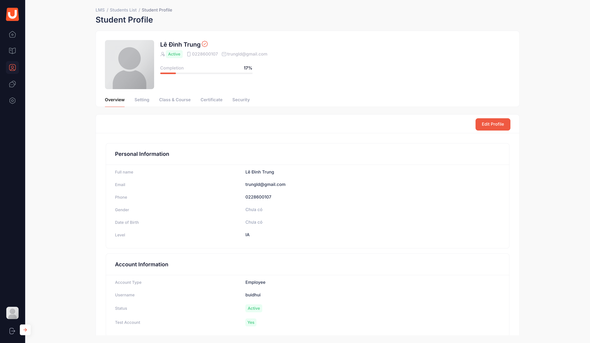

# Quản lý học viên (Students)

## I. Thông tin chung


**Dành cho:** UpLMS Operator

**Đường dẫn:** User Management → Students



#### Phạm vi & Module liên quan

* **Module chính:** User Management (Students)



#### Điều kiện tiên quyết

* Đã có tài khoản và được cấp quyền truy cập hệ thống UpLMS Ops.
* Tài khoản có quyền tương ứng với từng chức năng cần thực hiện (crud).


## II. Hướng dẫn chi tiết

Danh sách và chi tiết học viên



**Truy cập Student List**

Truy cập **User Management** → chọn **Students**.

<figure><figcaption></figcaption></figure>

Sử dụng các bộ lọc:

* **Search**: tìm theo Họ tên (Full name), Username, Email, Số điện thoại.
* **Status** (Trạng thái): chọn 1 trong các giá trị cho trước (Active/ Block).
* **Sort by**: sắp xếp theo Họ tên.
* **From Date - To Date**: lọc theo ngày cập nhật thông tin.



**Xem chi tiết thông tin học viên**

Nhấn vào tên học viên hoặc nhấn **Action → View Profile**.

Màn hình Student Profile hiển thị các tab:

* **Overview**: Hiển thị Personal Information và Account Information

<figure><figcaption></figcaption></figure>

* **Class and Course**: Danh sách khóa học học viên đang tham gia

<figure><figcaption></figcaption></figure>

* _**Security**_: Lịch sử đăng nhập UpLMS.

<figure><figcaption></figcaption></figure>



**Xuất danh sách ra Excel**

* Tại màn hình Student List, chọn **Export** để hệ thống xuất danh sách học viên (theo điều kiện tìm kiếm hiện tại) thành file Excel và tự động tải về thiết bị.
* Các trường thông tin được trích xuất ra file Excel bao gồm: ID, Full name, Username, Email, Phone, Type User, Status.



Tạo tài khoản học viên

Tài khoản học viên được đồng bộ tự động từ hệ thông tin nhấn sự của UpBase.

Chỉnh sửa thông tin học viên

Thông tin học viên được đồng bộ từ thông tin nhân sự của tổ chức. Do đó không thể thay đổi thông tin học viên trên UpLMS, ngoại trừ trường tên đăng nhập (Username)

Trạng thái học viên

Học viên có 2 trạng thái:

| Trạng thái | Mô tả                                                   |
| ---------- | ------------------------------------------------------- |
| Active     | Tài khoản đang được kích hoạt, có thể đăng nhập vào UpLMS |
| Block      | Tài khoản bị khóa, không thể đăng nhập vào LMS Student  |

Có 4 cách thay đổi trạng thái:



**Cách 1: Thay đổi qua nút Action**

Tại Student List → **Action** → **Block** (áp dụng cho tài khoản đang Active) → Xác nhận thay đổi trạng thái.

<figure><figcaption></figcaption></figure>



**Cách 2: Thay đổi qua cột Status trong bảng danh sách**

Tại Student List, nhấn chuyển **Status** tương ứng với học viên cần đổi trạng thái tại cột thông tin Status → chọn **Block** (áp dụng cho tài khoản đang Active) / chọn **Active** (áp dụng cho tài khoản đang Block) → Xác nhận thay đổi trạng thái.

<figure><figcaption></figcaption></figure>



**Cách 3: Thay đổi qua trường Status trong Student Profile**

Student Profile → Setting → chọn giá trị mới (Active/ Block) để chuyển đổi trạng thái tài khoản học viên đó.

<figure><figcaption></figcaption></figure>



**Cách 4: Xóa thông tin nhân sự trong hệ thống thông tin của tổ chức**

Khi tài khoản nhân sự bị xóa trong hệ thống thông tin của tổ chức do nghỉ việc, hệ thống UpLMS Ops tự động chuyển tài khoản học viên đó sang trạng thái Block.




Khi học viên bị **Block**, hệ thống sẽ tự động đăng xuất tất cả thiết bị đang đăng nhập của học viên đó.


## III. Các lỗi thường gặp & Hướng dẫn xử lý

| Lỗi / Tình huống                                           | Nguyên nhân                          | Cách xử lý                                                                                              |
| ---------------------------------------------------------- | ------------------------------------ | ------------------------------------------------------------------------------------------------------- |
| Không tìm thấy học viên trong danh sách                    | Bộ lọc quá hẹp hoặc nhập sai từ khóa | Nhấn **Reset** để xóa toàn bộ bộ lọc, thử lại với từ khóa khác.                                         |
| Học viên bị Block có thể tự kích hoạt lại tài khoản không? |                                      | Không. Chỉ người dùng có quyền trên hệ thống UpLMS Ops mới có thể thay đổi trạng thái từ Block về Active. |
